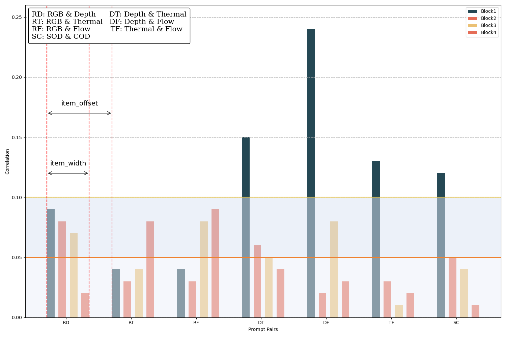
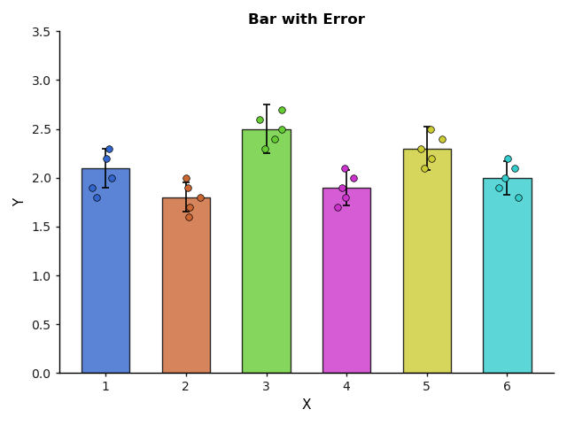
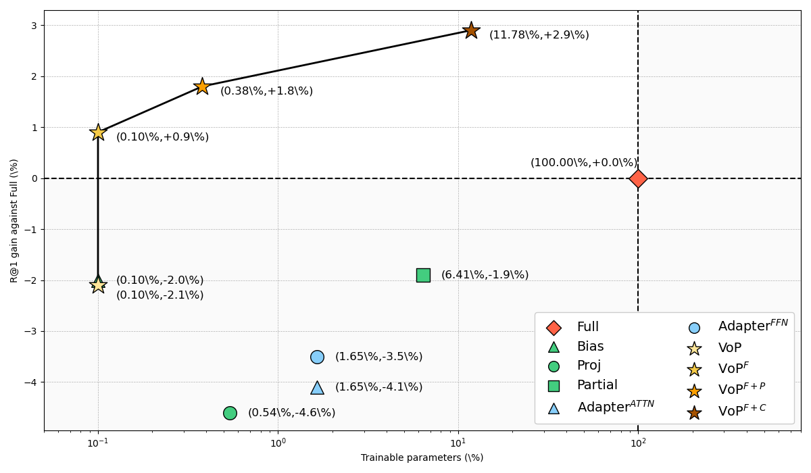
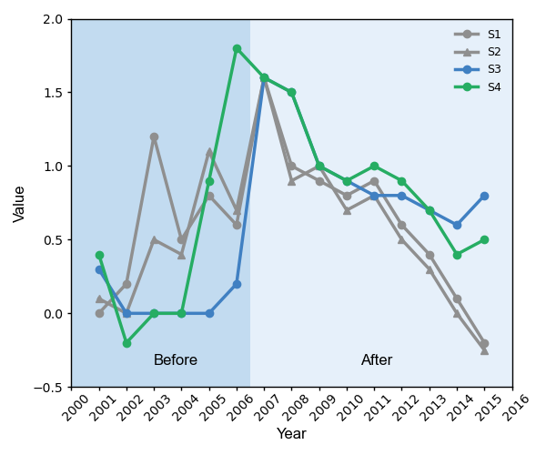
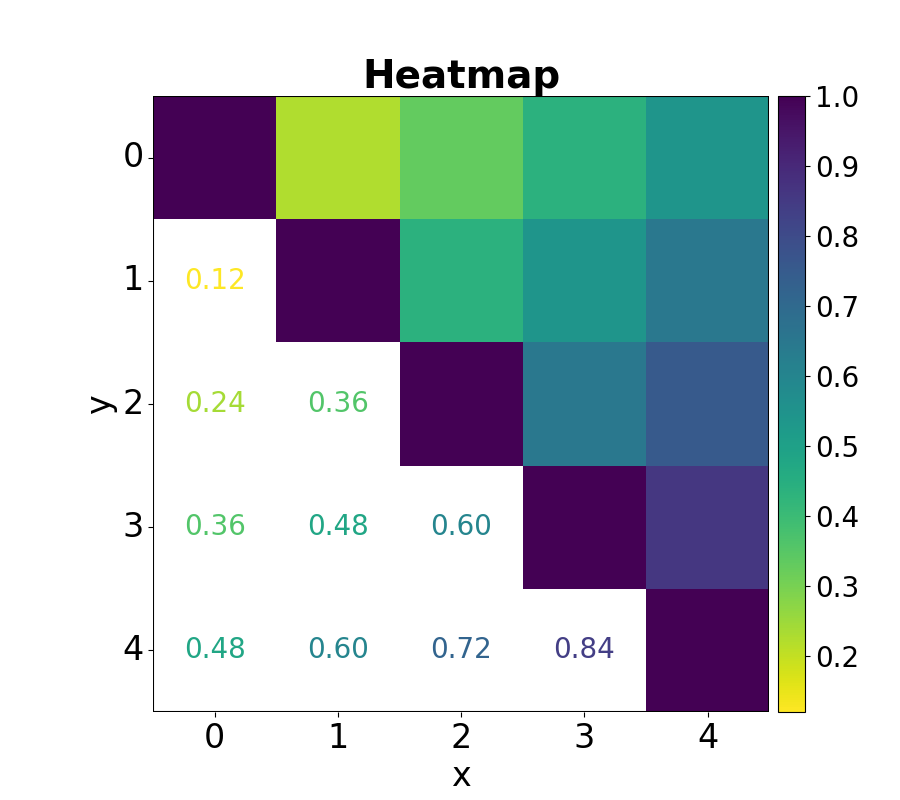

# PaperPlots

| Figure                               | Script                         | Reference                                                                                                                  |
| ------------------------------------ | ------------------------------ | -------------------------------------------------------------------------------------------------------------------------- |
|          | [bar-0.py](./bar-0.py)         | [VSCode: General Visual Salient and Camouflaged Object Detection with 2D Prompt Learning](http://arxiv.org/abs/2311.15011) |
|          | [bar-1.py](./bar-1.py)         | [Matlab进阶绘图第88期-带抖动点的误差棒柱状图](https://mp.weixin.qq.com/s/ZNoONMzxk0EEa6bW3G8etQ)                           |
|  | [scatter-0.py](./scatter-0.py) | [VoP: Text-Video Co-operative Prompt Tuning for Cross-Modal Retrieval](https://arxiv.org/abs/2211.12764)                   |
|  | [scatter-1.py](./scatter-1.py) | [师弟想发SCI，问我这张折线图怎么改？Matlab美图教程第1期](https://mp.weixin.qq.com/s/ngOR-CUMfGmgODc-6O9isA)                |
|  | [heatmap-0.py](./heatmap-0.py) | [Matlab个性化绘图第23期-半文字半热图](https://mp.weixin.qq.com/s/0X9yyPlGBFN__GkltLvFTA)                                   |
